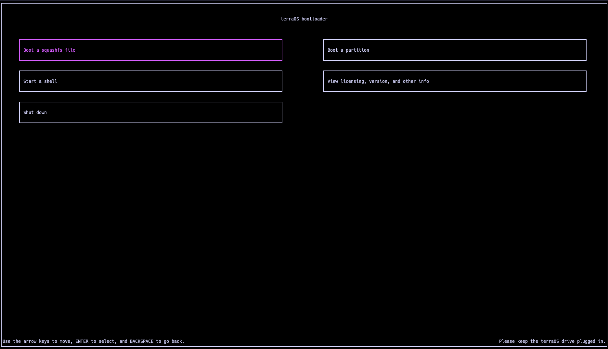

# terraOS
Boot Linux-based operating systems from a RMA shim.

## How does it work?
terraOS utilizes a bug in chromebook RMA shims, which are bootable recovery images that are used for running diagnostic utilities, to chainload regular Linux distros by replacing the rootfs. Replacing the rootfs entirely doesn't work however, since the RMA shim boots in an environment made specifically for those diagnostic utilities. terraOS is made to get around that. 

## How do I add my own distros?
You'll need to create a partition with the type `chromeOS rootfs` (`3cb8e202-3b7e-47dd-8a3c-7ff2a13cfcec`) and bootstrap your distro in the root of an ext4 filesystem on that partition. Place any squashfs files in the root of the first partition.

## How do I use it?
1. Clone this repo.
2. Create a build directory.
3. Run `bash ../scripts/build_stage1.sh <defconfig>`
  1. Use `terraos` as the defconfig if building for x86_64 chromebooks.
  2. Use `terraos_jacuzzi` as the defconfig if building for `jacuzzi` board chromebooks. Support for `jacuzzi` board chromebooks is experimental and may not work, however.
4. Run `bash ../scripts/build_aur_packages.sh`
5. Run `bash ../scripts/build_all.sh <shim.bin> <board_recovery.bin> <reven_recovery.bin>` replacing `<shim.bin>` with the path to a shim for your board, `<board_recovery.bin>` with the path to a recovery image for your board, and `<reven_recovery.bin>` with the path to a chromeOS flex recovery of the same version. 

This will place a built bootloader image, squashfs and tarballs of the arch rootfs, a bootloader image with the arch rootfs, a bootloader image with terraOS chromeOS, and a bootloader image with both the arch rootfs and terraOS chromeOS in the build directory.

The default arch rootfs user is `terraos` and its password is `terraos`.

## How do I install to internal storage?
1. Boot into terraOS and copy over the image you used to flash your terraOS drive.
2. Use GParted or `sudo fdisk -l` to find your internal storage. Replace `/dev/mmcblkX` in the rest of the steps with the internal storage device.
3. Run `sudo dd if=<image> of=/dev/mmcblkX status=progress bs=16M oflag=direct` to write the image to the internal storage. Replace `<image>` with the path to the image you copied.

Alternatively you can manually create a `chromeOS rootfs` type partition via `parted` or `fdisk`, format as ext4, and copy over the rootfs.

## FAQ

### Can I automatically boot into a partition?
Yes, edit `/sbin/init` on the terraOS boootloader partition and pass terraOS the arguments `autoboot <partnum>` where `<partnum>` is a partition number on the same disk as terraOS.

### What doesn't work?
- Deep sleep (kernel issue)
- Swap (disabled in kernel)
- Audio on dedede (firmware bug)

### Can I use a different distro?
Yes, you will need to either use a non-systemd distro or manually compile systemd with the [chromiumos patches](https://aur.archlinux.org/cgit/aur.git/tree/0002-Disable-mount_nofollow-for-ChromiumOS-kernels.patch?h=systemd-chromiumos).
